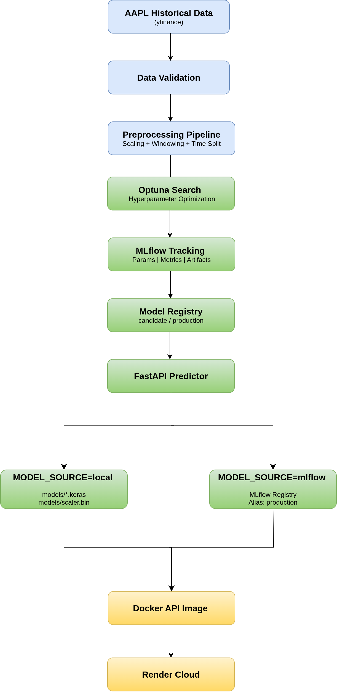
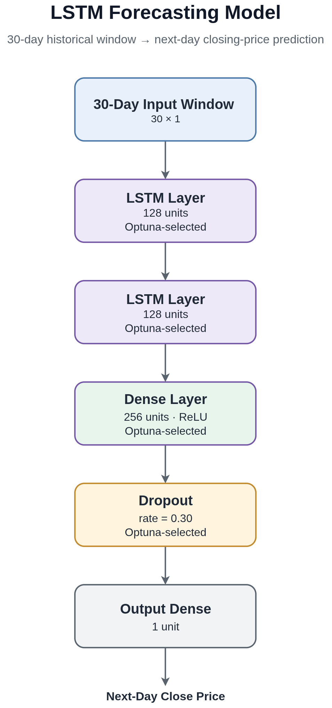
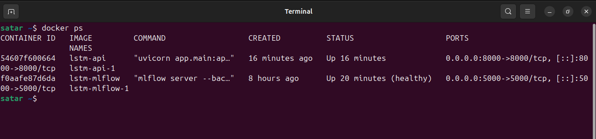
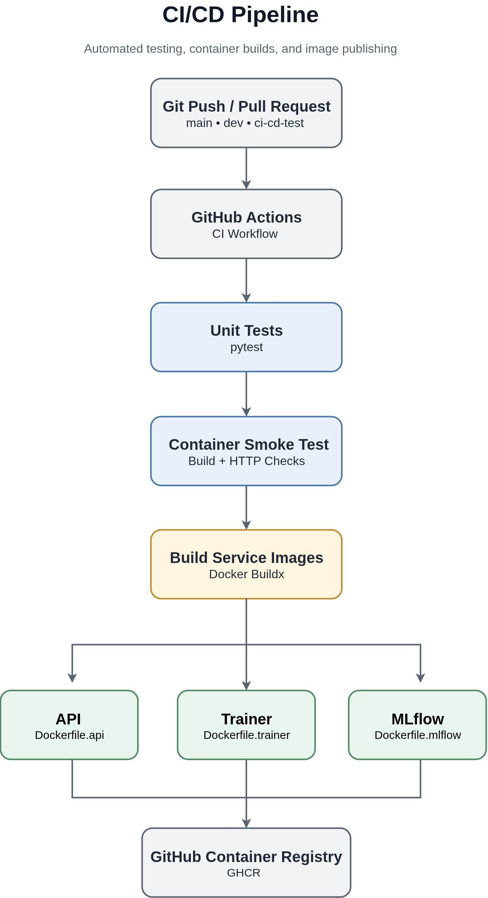

# System Architecture

## Overview

The project implements an end-to-end MLOps pipeline for time-series
forecasting using a stacked LSTM model. The architecture separates data
acquisition and preprocessing, model training and optimization, experiment
tracking and model management, inference, testing, and deployment into
independent, composable components.

The main components are:

- **Data pipeline** — downloads and validates historical stock data,
  performs preprocessing, scaling, and chronological train/validation/test
  splitting.

- **Training pipeline** — performs LSTM training, Optuna hyperparameter
  optimization, evaluation, and final model retraining through a modular
  training architecture.

- **Experiment tracking and model management** — uses MLflow for experiment
  tracking, artifact storage, and Model Registry functionality with
  alias-based model versioning.

- **Inference service** — provides a FastAPI API for predictions with support
  for two model-loading strategies: local model artifacts or the MLflow Model
  Registry.

- **Containerized deployment** — uses Docker and Docker Compose to separate
  the API, training, and MLflow services into independent environments.

- **CI/CD and cloud deployment** — uses GitHub Actions for automated testing,
  container smoke tests, and image publishing, with the API deployed to
  Render.
---

## End-to-End Pipeline

The complete workflow consists of separate stages for data acquisition and
preprocessing, model optimization, candidate evaluation, production
retraining, model management, inference, and deployment.



The diagram shows the complete path from historical market data through
preprocessing and model training to MLflow-based model management, the
FastAPI inference service, and cloud deployment.

### Data and preprocessing

The pipeline retrieves historical AAPL stock price data using `yfinance`.
The data is validated, scaled using `StandardScaler`, and converted into
supervised-learning sequences using a fixed rolling window of 30 trading
days.

The dataset is split chronologically:

- **Training set** — used for learning model parameters.
- **Validation set** — used for hyperparameter selection and model comparison.
- **Test set** — kept untouched until final candidate evaluation.

The current split is **90% training / 5% validation / 5% test**, with no
random shuffling. Chronological splitting prevents future information from
leaking into model development.

### Model optimization and training

The forecasting model uses a stacked LSTM architecture.



The model receives a 30-day rolling window of closing prices and processes the
sequence through two LSTM layers, followed by dense layers and a final
single-value output representing the next-day closing price.

Optuna performs hyperparameter optimization using validation RMSE% as the
optimization objective.

Each trial is tracked in MLflow with its hyperparameters, metrics, and model
artifacts.

After selecting the best configuration:

1. A **candidate model** is retrained on the combined training and validation
   data.
2. The candidate model is evaluated once on the untouched test set. This
   produces the pipeline's final reported performance metric.
3. A **production model** is retrained using all available historical data
   with the proven configuration.

The candidate model provides the honest held-out evaluation, while the
production model is the version prepared for inference.

The reasoning behind this three-stage training design is documented in
[`decisions.md`](decisions.md#separate-candidate-and-production-model-roles).

### Serving

The inference layer uses FastAPI and a single `Predictor` interface. The
model source is selected through the `MODEL_SOURCE` environment variable:

- **`local`** — loads the model and scaler from artifacts packaged inside the
  API container.
- **`mlflow`** — loads the production model through the MLflow Model Registry.

The current cloud deployment uses local artifact loading. The full deployment
workflow and migration path are documented in
[`deployment.md`](deployment.md).

---

## Docker Architecture

Docker Compose separates the main services into independent containers, each
with its own runtime environment and dependency set.



The local environment consists of three main services:

```text
Docker Compose
│
├── trainer
│   └── one-shot training job
│
├── mlflow
│   └── long-running tracking and registry service
│
└── api
    └── long-running FastAPI inference service
```

### Trainer service

The `trainer` container executes the complete training workflow described above:

* Loading and validating historical data.
* Running preprocessing.
* Executing Optuna hyperparameter search, with each trial tracked in MLflow.
* Selecting the best configuration based on validation RMSE%.
* Retraining and evaluating the candidate model on the untouched test set.
* Retraining the production model using the proven configuration and all available data.
* Logging parameters, metrics, models, and artifacts to MLflow.
* Producing the production artifacts used by local model serving.

The trainer runs as a one-off job rather than a persistent service:

```bash
docker compose run --rm trainer
```

The detailed training stages and candidate/production model roles are described in the
[Model optimization and training](#model-optimization-and-training) section.

### MLflow service

The `mlflow` container provides the local experiment tracking and model
management infrastructure:

* Experiment tracking.
* Artifact storage.
* Model Registry.
* Model version management through aliases.

It runs as a persistent service during local training and development:

```bash
docker compose up -d mlflow
```

### API service

The `api` container runs the FastAPI inference service.

Its responsibilities include:

- Loading the trained model and scaler.
- Validating prediction requests.
- Generating predictions.
- Handling model-loading and prediction failures through structured API error responses.
- Exposing health and prediction endpoints.
- Supporting both local and MLflow model-loading modes.

The supported configuration values are:

```text
MODEL_SOURCE=local
MODEL_SOURCE=mlflow
```

The live cloud deployment currently uses:

```text
MODEL_SOURCE=local
```

### Container separation design

The services are intentionally separated because their dependency footprints
are different:

* The training environment requires packages such as Optuna, yfinance, and
  pandas that are not required by the API at inference time.
* The API uses inference-specific dependencies and packages the production
  model artifacts into the image for local serving.
* The MLflow service provides the tracking and registry infrastructure.

This separation improves dependency isolation and reproducibility and makes
future deployment changes easier.

The measured image-size reduction from separating the services was only
approximately 1–2%, because TensorFlow dominates the API and trainer image
sizes. The separation is therefore primarily an architectural and dependency
isolation decision rather than an image-size optimization.

---

## Model Loading Architecture

The inference layer supports two model-loading strategies through the
`MODEL_SOURCE` environment variable.

`Predictor` provides a single interface for model loading and inference. The
rest of the application does not need to know where the model is stored or
how it is retrieved.

```text
                         FastAPI
                            │
                            ▼
                        Predictor
                            │
                 ┌──────────┴──────────┐
                 │                     │
                 ▼                     ▼
        MODEL_SOURCE=local      MODEL_SOURCE=mlflow
                 │                     │
                 ▼                     ▼
        Local model artifacts   MLflow Model Registry
                 │                     │
                 │                     ▼
                 │             Model alias: production
                 │
        ┌────────┴────────┐
        │                 │
        ▼                 ▼
production_model.keras  scaler.bin
```

### Local model loading

With:

```text
MODEL_SOURCE=local
```

the predictor loads:

```text
models/
├── production_model.keras
└── scaler.bin
```

from the API container filesystem.

The API Dockerfile includes the model artifacts during image construction:

```dockerfile
COPY models ./models
```

This makes the API image self-contained for lightweight deployments.

### MLflow Registry loading

With:

```text
MODEL_SOURCE=mlflow
```

the predictor loads the production model through the MLflow Model Registry:

```text
models:/LSTMStockPredictor@production
```

The Registry provides:

* Model version history.
* Alias-based model promotion.
* Centralized model management.
* The ability to change the served model without modifying application code.

The MLflow-backed serving mode is implemented and tested locally through
Docker Compose.

The tradeoffs between the two serving modes are documented in
[`decisions.md`](decisions.md#support-both-local-and-mlflow-model-loading).

---

## Current Production Deployment

The live deployment uses the lightweight local-artifact serving architecture.

```text
Training
(local, Docker Compose)
│
▼
Production artifacts
│
├── models/production_model.keras
└── models/scaler.bin
│
▼
API Docker image
(COPY models ./models)
│
▼
Render Cloud Deployment
(MODEL_SOURCE=local)
```

The deployed API does not require an MLflow server at runtime.

The practical deployment workflow, external verification, and migration path
are documented in [`deployment.md`](deployment.md).

---

## CI/CD Architecture

GitHub Actions provides automated validation and container image publishing
for the project.



The workflow runs on pushes to `main`, `dev`, and `ci-cd-test`, and on pull
requests targeting `main` or `dev`.

The pipeline consists of three main stages:

1. **Unit tests** — runs the fast test suite with external MLflow-dependent
   tests excluded.
2. **Container smoke test** — builds the real API image, starts it as a
   container, and verifies the health and prediction endpoints through real
   HTTP requests.
3. **Build and publish** — on push events, builds and publishes the API,
   trainer, and MLflow images to GitHub Container Registry after the previous
   stages succeed.

The complete workflow and testing strategy are documented in
[`testing.md`](testing.md).

---
## Project Structure

The repository is intentionally organised around clear separation of concerns: **ML pipeline, model training, inference, API serving, testing, documentation, and deployment infrastructure**.

The structure reflects the current production-oriented architecture of the project.

```text
lstm-time-series-mlops/
├── .github/
│   └── workflows/
│       └── ci.yml                       # GitHub Actions: tests, smoke tests, image publishing
│
├── src/                                  # Core ML pipeline
│   ├── config.py                        # Single source of truth for ML/training configuration
│   │
│   ├── data/
│   │   ├── __init__.py
│   │   ├── loader.py                    # StockLoader — yfinance data acquisition + validation
│   │   └── preprocessor.py              # Scaling, windowing, chronological train/val/test split
│   │
│   ├── models/
│   │   ├── __init__.py
│   │   └── lstm_model.py                # LSTMForecaster — model architecture + compilation
│   │
│   ├── training/
│   │   ├── __init__.py
│   │   ├── trainer.py                   # TimeSeriesTraining — end-to-end training orchestration
│   │   ├── optuna_tuner.py              # LSTMOptuna — hyperparameter search + MLflow logging
│   │   ├── single_model_trainer.py      # SingleModelTrainer — trains one model configuration
│   │   ├── evaluator.py                 # LSTMEvaluator — MAE, RMSE and RMSE%
│   │   ├── mlflow_manager.py            # MLFlowManager — params, metrics, models and artifacts
│   │   ├── model_registry.py            # ModelRegistry — registration, aliases and model loading
│   │   ├── callbacks.py                 # EarlyStopping + ReduceLROnPlateau factory
│   │   ├── summary.py                   # TrainingSummary — structured training output
│   │   └── utils.py                     # Reproducibility utilities such as random seeding
│   │
│   └── inference/
│       ├── __init__.py
│       └── predictor.py                 # Predictor — local/MLflow model loading + prediction
│
├── app/                                  # FastAPI serving application
│   ├── __init__.py
│   ├── main.py                          # FastAPI application entrypoint
│   ├── example.py                       # Example prediction payload for Swagger UI
│   │
│   ├── api/
│   │   └── routes/
│   │       ├── __init__.py
│   │       ├── health.py                # GET /api/v1/health
│   │       └── prediction.py            # POST /api/v1/predict
│   │
│   ├── core/
│   │   ├── __init__.py
│   │   ├── config.py                    # APISettings — environment-based configuration
│   │   ├── exceptions.py                # ModelLoadError, PredictionFailedError
│   │   ├── exception_handlers.py        # Custom exception-to-response mapping
│   │   └── logger.py                    # Structured JSON logging
│   │
│   └── schemas/
│       ├── __init__.py
│       ├── health.py                    # HealthResponse
│       └── prediction.py                # PredictRequest + PredictResponse
│
├── tests/                                # Automated test suite
│   ├── test_api.py                      # FastAPI integration tests
│   ├── test_data_loader.py              # StockLoader unit tests
│   ├── test_lstm_model.py               # LSTMForecaster unit tests
│   ├── test_model_registry.py           # ModelRegistry unit tests
│   ├── test_predictor.py                # Predictor unit tests
│   ├── test_predictor_integration.py    # MLflow inference integration test
│   └── test_preprocessor.py             # Preprocessing and split tests
│
├── docs/                                  # Project documentation
│   ├── architecture.md                  # System architecture and repository structure
│   ├── decisions.md                     # Engineering decisions
│   ├── deployment.md                    # Deployment and production serving
│   ├── mlflow.md                        # MLflow tracking and model management
│   ├── testing.md                       # Testing strategy and verification
│   └── images/
│       ├── screenshots/                 # UI and deployment screenshots
│       └── ...                          # Documentation diagrams
│
├── notebooks/                            # Historical experiments and MLflow demonstrations
│   ├── LSTM_Training_MLflow.ipynb       # MLflow training experiments
│   ├── Load_Save_registered_Model.ipynb # Model Registry experiments
│   └── train_legacy.py                  # Original flat training implementation
│
├── models/                               # Production model artifacts
│   ├── production_model.keras            # Production LSTM model artifact
│   └── scaler.bin                       # Production preprocessing scaler
│
├── mlruns/                               # Gitignored legacy local MLflow metadata
├── mlartifacts/                          # Gitignored local MLflow artifact storage
├── mlflow.db                             # Gitignored MLflow SQLite backend
├── .env                                  # Gitignored local environment variables
├── .env.example                          # Committed environment template
│
├── .dockerignore                         # Docker build exclusions
├── .gitignore                            # Git exclusions
├── Dockerfile.api                        # API service image
├── Dockerfile.trainer                    # Training service image
├── Dockerfile.mlflow                     # MLflow service image
├── docker-compose.yml                    # Local multi-service orchestration
├── pytest.ini                             # Pytest configuration
│
├── requirements.api.lock                 # Pinned API dependencies
├── requirements.trainer.lock             # Pinned trainer dependencies
├── requirements.mlflow.lock              # Pinned MLflow dependencies
├── requirements-dev.txt                  # Development and testing dependencies
│
└── README.md                             # Project overview and quickstart
```

