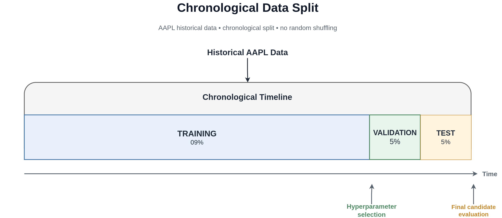
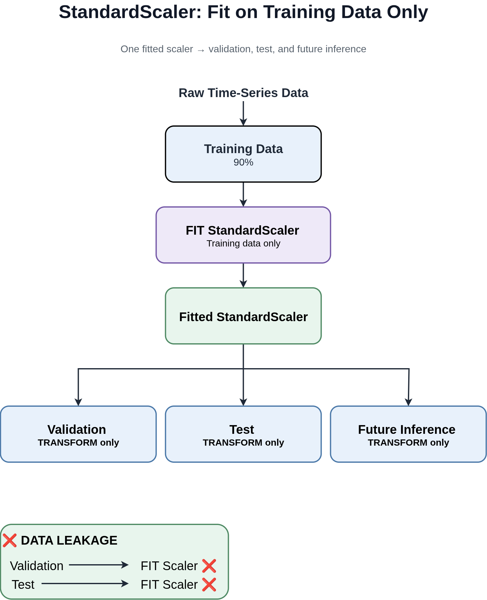
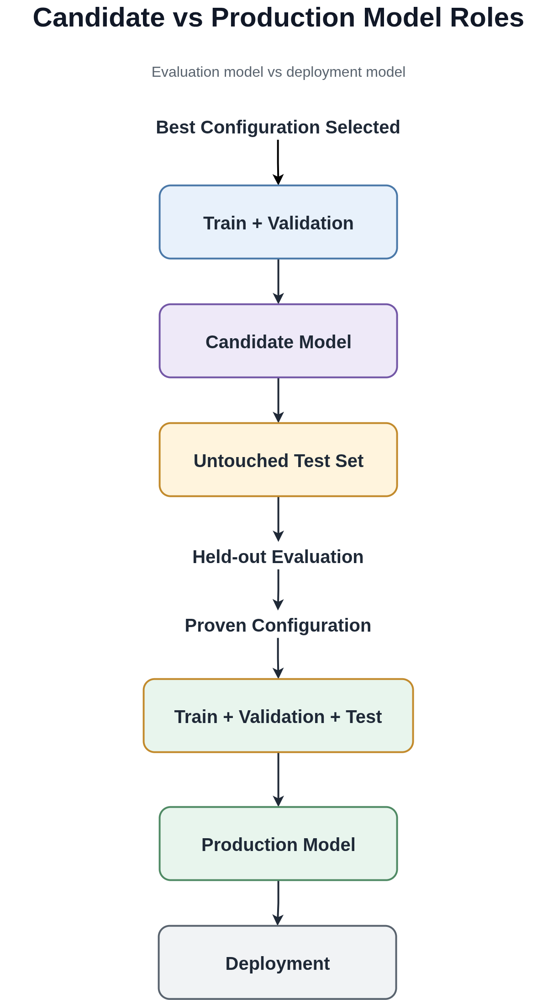

# Engineering Decisions

This document records the main technical decisions made during the development
of the LSTM Time Series Forecasting MLOps project and the reasoning behind
them. Where a decision resulted in a real incident or investigation, the
relevant details are linked to the incident records in the
[README](../README.md) or the dedicated documentation.

---

**## Use chronological train/validation/test splitting**



**### Decision**

Use a chronological three-way split:

- **90% training**
- **5% validation**
- **5% test**

with no random shuffling.

**### Reason**

This is a time-series forecasting problem, so future observations must not
influence model development for earlier periods.

Random splitting could introduce temporal leakage by allowing observations from
later periods to appear in the training data while earlier periods are used for
validation or testing.

The validation set is used for hyperparameter optimization and model
comparison, while the test set remains isolated until final candidate
evaluation.

**### Consequence**

The current split was reached empirically rather than assumed from the
beginning. An earlier 70/15/15 split produced a substantially larger
validation-test generalization gap. Two hypotheses were investigated before
changing the split ratio; the investigation is documented in the
[README](../README.md#investigation-closing-the-validation-test-gap).

---

## Fit `StandardScaler` on training data only



Fit `StandardScaler` exclusively on the training data and use the fitted
scaler unchanged for validation, test, and future inference data.

Fitting the scaler on validation or test data would expose information about
those datasets to the training pipeline, creating a form of data leakage.

The fitted scaler is persisted as an artifact alongside the model so that
inference uses exactly the same transformation applied during training.

---

## Use Optuna for hyperparameter optimization

### Decision

Use Optuna with a TPE sampler to search the main LSTM training
hyperparameters instead of relying on manual tuning.

The current search covers:

* LSTM units
* Dense layer size
* Dropout rate
* Learning rate
* Batch size
* Gradient clipping value

### Reason

LSTM performance is sensitive to both architecture and optimization
parameters. Automated search provides a reproducible way to compare
configurations and integrates naturally with MLflow.

Each trial is recorded in MLflow with its hyperparameters, validation metrics,
and associated training artifacts, creating a persistent and inspectable
history of the search.

### Consequence

The current search space uses categorical values through
`suggest_categorical`. Continuous parameter ranges and Optuna pruning are
possible future improvements, but were intentionally kept outside the current
scope.

---

## Use MLflow for experiment tracking and model management

### Decision

Use MLflow for:

* experiment tracking
* parameter and metric logging
* artifact storage
* model registration
* model versioning
* alias-based model promotion

### Reason

Saving model files locally only answers whether a model exists. It does not
provide a reliable record of which configuration produced it, how it
performed, or which version should be served.

MLflow provides persistent experiment history, parameter and metric tracking,
artifact storage, model registration, and alias-based model promotion.

Each Optuna trial is tracked in MLflow, allowing its hyperparameters,
validation metrics, and training artifacts to be inspected alongside the
corresponding experiment run. The selected configuration can then be used for
the candidate and production training stages while preserving the experiment
history that led to that configuration.

### Consequence

MLflow introduces additional infrastructure requirements, including a
persistent tracking server and artifact storage. This directly influenced the
decision to support both MLflow-backed and lightweight local model serving.

The MLflow-specific implementation and migration considerations are documented
in [`mlflow.md`](mlflow.md).

---

**## Separate candidate and production model roles**



**### Decision**

Every completed training workflow produces two distinct model roles:

- **`candidate`** — trained on train + validation and evaluated once on the
  untouched test set.
- **`production`** — retrained on train + validation + test using the proven
  configuration.

**### Reason**

The two models answer different questions.

The candidate model answers:

> How well does this configuration generalize to genuinely unseen data?

It therefore receives the only trustworthy held-out test evaluation in the
pipeline.

The production model answers:

> What model should actually be deployed after the configuration has been
> validated?

Once the candidate configuration has been evaluated, the production model is
retrained using all available historical data so that the deployed model can
benefit from the maximum amount of training information.

**### Consequence**

The production model has no independent held-out test score of its own because
the available test data has already been used to validate the candidate
configuration.

This is intentional. The production model is a deployment artifact, not a
second independent evaluation model. This distinction is documented
explicitly in the README and MLflow documentation.

---

## Use a separate Docker image for each service

### Decision

Use independent Dockerfiles and pinned dependency files for:

* `trainer`
* `api`
* `mlflow`

instead of using one shared application image.

### Reason

Each service has a different responsibility and dependency footprint.

The trainer requires packages such as Optuna, yfinance, and pandas that are
not needed by the API during inference. The MLflow service has its own much
smaller runtime requirements.

Separate images provide:

* dependency isolation
* reproducible environments
* clearer service boundaries
* greater deployment flexibility

### Consequence

The image split produced only a small measured size reduction of roughly
1–2%, because TensorFlow dominates the image size and is shared by the
training and API environments.

The split was therefore retained primarily for dependency isolation and
reproducibility rather than as a major image-size optimization.

More significant image-size improvements, such as `tensorflow-cpu` and
multi-stage builds, remain future work.

---

## Support both local and MLflow model loading

### Decision

The `Predictor` supports two model-loading modes selected through the
`MODEL_SOURCE` environment variable:

```text
MODEL_SOURCE=local
```

or:

```text
MODEL_SOURCE=mlflow
```

### Reason

Different deployment environments have different infrastructure constraints.

Local artifact loading provides a lightweight option where running an MLflow
server is unnecessary or too expensive.

MLflow Registry loading provides a more mature model-management workflow with
centralized versioning, aliases, and model promotion.

Both modes expose the same `Predictor` interface, so the API does not need to
know where the model is stored.

### Consequence

Changing the model source requires configuration rather than application
code changes. This keeps the inference layer independent from the underlying
model-storage strategy.

---

## Use local model artifacts for the current cloud deployment

### Decision

The current Render deployment uses:

```text
MODEL_SOURCE=local
```

with the production model and scaler packaged into the API container.

### Reason

The current cloud environment has a constrained memory budget. Running both
FastAPI and a continuously available MLflow server is not practical within
the free-tier resource limits.

Local model loading removes the MLflow runtime dependency from the deployed
API while keeping the MLflow workflow available for training, tracking, and
local Registry-based serving.

### Consequence

The current deployment is intentionally a lightweight deployment rather than
the final infrastructure architecture.

The MLflow-backed serving mode remains implemented and tested, providing a
clear migration path when dedicated ML infrastructure and persistent artifact
storage become available.

See [`deployment.md`](deployment.md) for the complete deployment rationale
and migration path.

---

## Pin complete dependency environments

### Decision

Use complete dependency lockfiles for the service environments rather than
pinning only direct, top-level packages.

### Reason

Machine-learning frameworks can contain large and independently versioned
dependency trees.

This became a real issue during development: TensorFlow was pinned, but Keras
was resolving to a different version between the training environment and the
Docker environment. The resulting version mismatch caused a model-loading
failure at container startup.

The solution was to explicitly pin the required Keras version and generate
complete lockfiles containing the resolved dependency tree.

### Consequence

Training and serving environments now use the same resolved dependency
versions, reducing the risk of environment-specific model-loading failures.

The full incident is documented in the
[README](../README.md#incident-record-kerastensorflow-version-drift).

---

## Prioritize reproducibility and deployability over model complexity

### Decision

Prioritize:

* reproducible training
* reliable deployment
* maintainable architecture
* observable experiments
* testable components

over increasing model complexity solely to improve the final metric.

### Reason

The primary purpose of this project is to demonstrate an end-to-end ML
engineering workflow rather than to build the most sophisticated possible
forecasting model.

A simpler model with an honest evaluation process, reproducible training,
versioned artifacts, automated tests, and reliable deployment provides more
practical engineering value than a more complex model built on an unreliable
pipeline.

### Consequence

Potential improvements such as walk-forward validation, broader
hyperparameter spaces, pruning, monitoring, and more sophisticated forecasting
architectures are treated as future extensions rather than prerequisites for
considering the current system complete.
