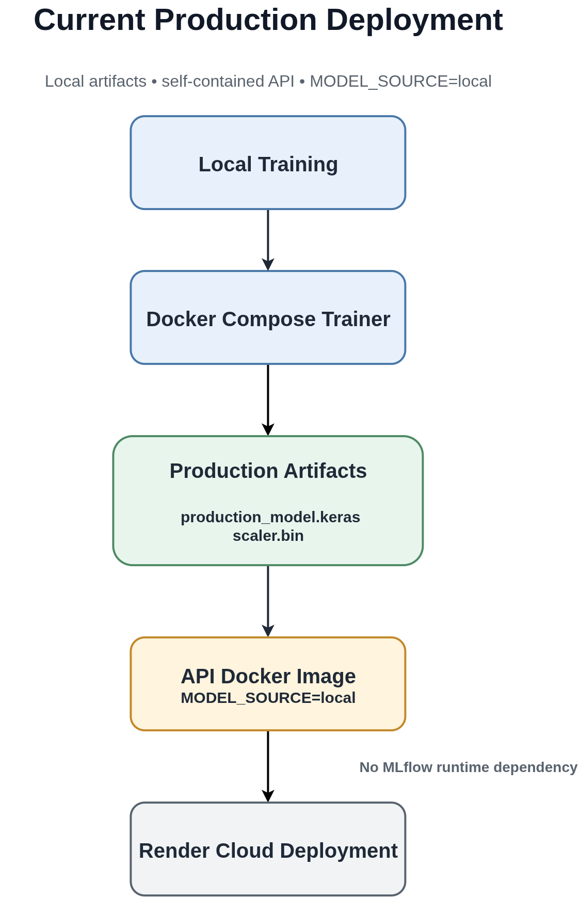
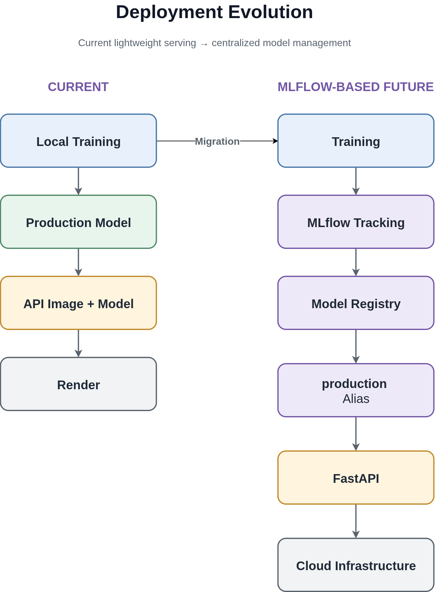

# Deployment

## Overview

The project supports two deployment approaches:

1. **Local artifact deployment** — currently used for the live Render
   deployment.
2. **MLflow Registry deployment** — implemented and tested locally through
   Docker Compose, intended for environments with dedicated ML infrastructure.

The current production deployment uses local artifacts because the deployed API
does not need an MLflow server at runtime. MLflow remains part of the local
training and model-management workflow.

The engineering reasoning behind this choice is documented in
[`decisions.md`](decisions.md#use-local-model-artifacts-for-the-current-cloud-deployment).

---

## Current Production Deployment

**Platform:** Render
**Model source:** `MODEL_SOURCE=local`
**Live API:** `https://lstm-api-prod.onrender.com`

The deployed architecture is:



The API image is self-contained. It contains the FastAPI application,
pinned dependencies, trained production model, and scaler. No external model
storage or MLflow connection is required during inference.

The live deployment was externally verified against the root, health, and
prediction endpoints.

---

## Deployment Workflow

### 1. Train the model locally

The complete training pipeline is executed locally using Docker Compose.

Start MLflow:

```bash
docker compose up -d mlflow
```

Run the trainer:

```bash
docker compose run --rm trainer
```

The trainer performs:

* Data loading and preprocessing.
* Optuna hyperparameter optimization.
* Candidate model training.
* Candidate evaluation on the untouched test set.
* Production model retraining using all available data.
* MLflow experiment tracking, artifact logging, and model registration.
* Saving production artifacts for local model serving.

After training, the production artifacts are available as:

```text
models/
├── production_model.keras
└── scaler.bin
```

### 2. Build the API image

`Dockerfile.api` packages the trained artifacts into the API image:

```dockerfile
COPY models ./models
```

Build the image:

```bash
docker compose build api
```

The resulting image contains everything required for inference:

* FastAPI application.
* Pinned Python dependencies.
* Production model.
* Fitted scaler.

Nothing external is required for model loading at runtime.

### 3. Deploy to Render

The API image is deployed to Render with:

```text
MODEL_SOURCE=local
```

At startup, the API loads:

```text
models/production_model.keras
models/scaler.bin
```

directly from the container filesystem.

MLflow is not contacted during inference.

---

## Why Local Model Loading Is Used

The MLflow Registry serving architecture is fully implemented and tested
locally, but it is not currently used by the cloud deployment.

The main constraint is infrastructure capacity:

* The Render free tier has limited memory.
* Running FastAPI and a continuously available MLflow server together would
  increase resource usage beyond what is practical for the current deployment.
* The API does not require experiment tracking during inference.

Local artifact loading therefore provides:

* Lower memory usage.
* Simpler deployment.
* Faster startup.
* No runtime dependency on MLflow availability.
* A self-contained API container.

This is an intentional deployment trade-off rather than a limitation of the
model-management architecture.

---

## MLflow Registry Deployment

The project also supports:

```text
MODEL_SOURCE=mlflow
```

In this mode, the API loads the production model from the MLflow Model
Registry using the `production` alias:

```text
models:/LSTMStockPredictor@production
```

The deployment architecture becomes:

```text
Training
   │
   ▼
MLflow Tracking Server
   │
   ▼
MLflow Model Registry
   │
   ▼
Production Alias
   │
   ▼
FastAPI API
   │
   ▼
Cloud Deployment
```

This approach provides several advantages over packaging the model directly
inside the API image:

* Centralized model management.
* Model version history.
* Alias-based model promotion.
* Ability to change the served model without rebuilding the API image.
* Clearer separation between model management and application deployment.

The MLflow serving mode is currently a supported and tested deployment option.
It requires a reachable MLflow tracking server, a Model Registry, and
persistent artifact storage suitable for the deployment environment.

---

## Migration from Local to MLflow Serving

Moving the current deployment to MLflow-backed serving requires
infrastructure and configuration changes, not application-code changes.

### 1. Deploy persistent MLflow infrastructure

Provide a reachable MLflow tracking server with sufficient resources for the
API and training/model-management workflow.

### 2. Configure durable artifact storage

For a cloud deployment, artifacts should be stored in durable external
storage, such as an S3-compatible object store, rather than relying on a local
container filesystem.

### 3. Change the model source

Change:

```text
MODEL_SOURCE=local
```

to:

```text
MODEL_SOURCE=mlflow
```

### 4. Redeploy the API

The existing `Predictor` interface and FastAPI application remain unchanged.

The model source is controlled entirely through configuration.

---

## Deployment Limitations

The current deployment intentionally has several limitations:

* **No automated retraining-to-deployment pipeline.** A new production model
  currently requires retraining, rebuilding the API image, and redeploying.
* **Model updates require an image rebuild.** Because the model is packaged
  into the API image, changing the deployed model requires rebuilding the
  image.
* **No live MLflow serving in the cloud.** The current deployment uses local
  artifacts because of infrastructure constraints.
* **No production monitoring or drift detection.** Post-deployment model
  performance and data drift are not currently monitored.

These are tracked as optional future improvements rather than blockers to the
current deployment.

---

## Future Deployment Direction

The intended evolution is:



The current architecture therefore provides a lightweight deployment that
works within constrained infrastructure while preserving a clear migration
path toward centralized model management and automated model promotion.
