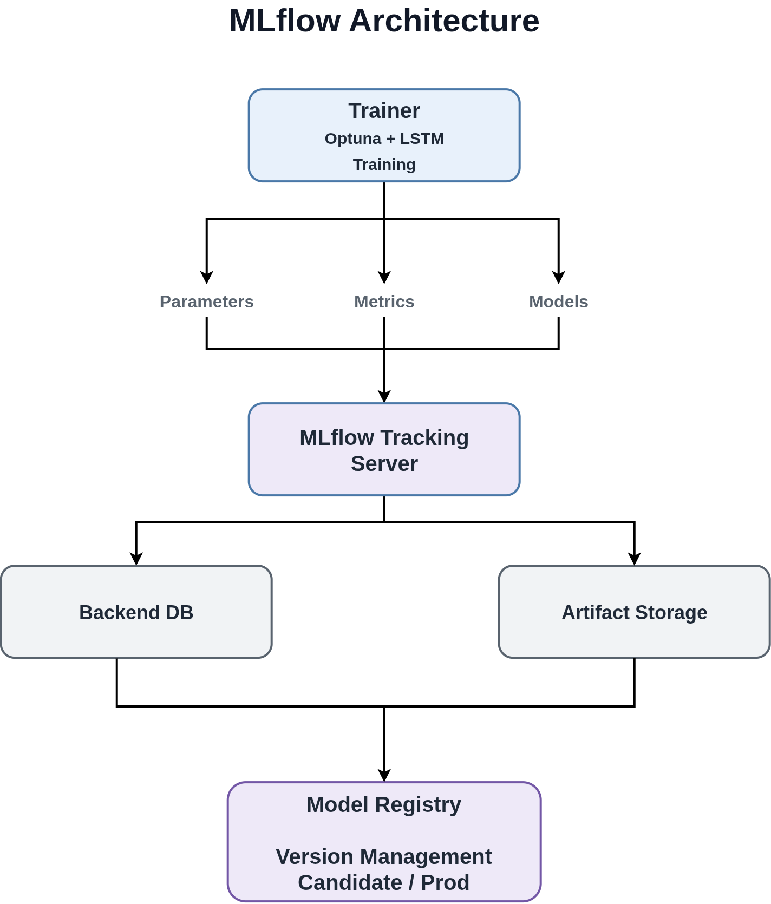
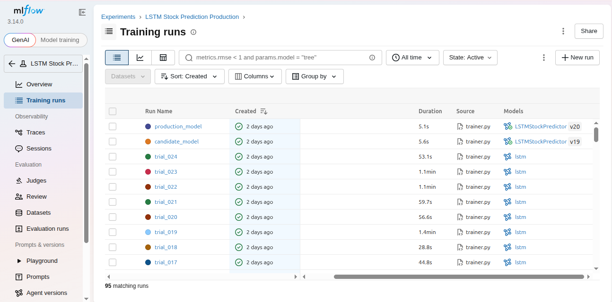
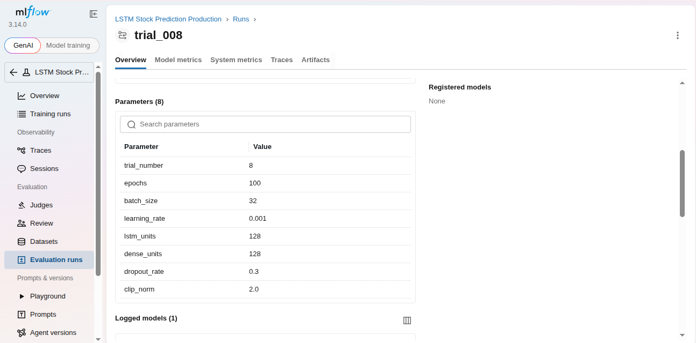
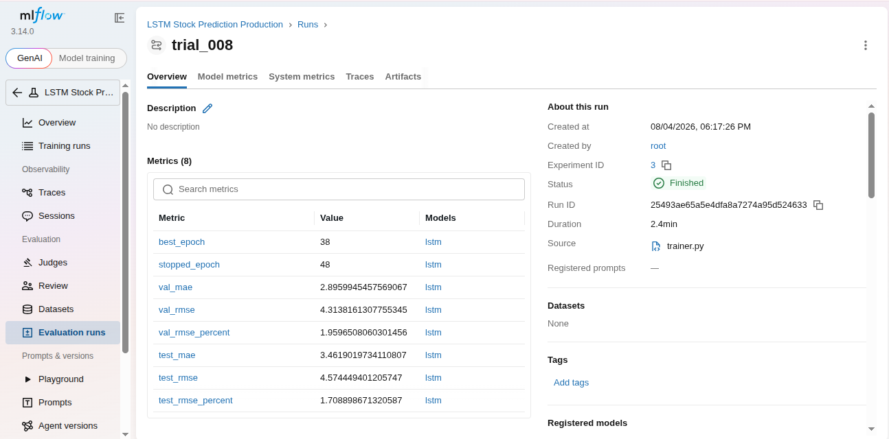
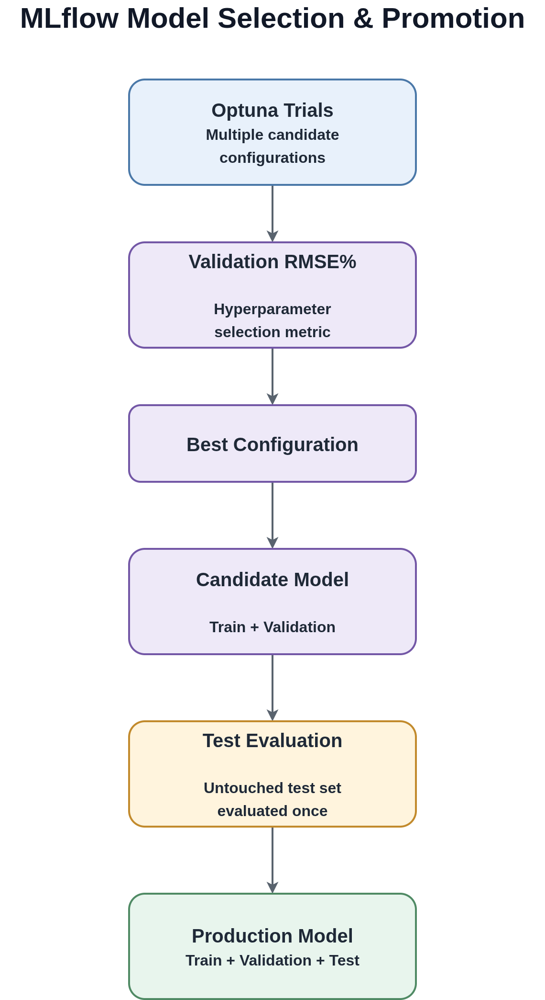
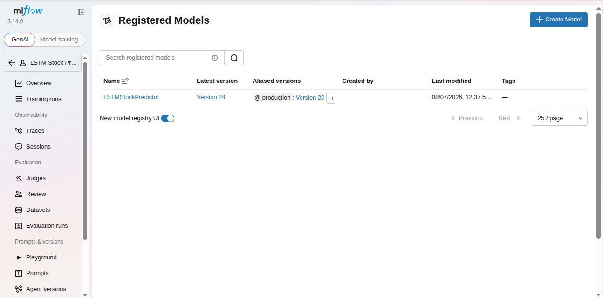

# MLflow: Experiment Tracking and Model Management

## Overview

MLflow is the experiment tracking and model management layer of the project.

It is integrated directly into the training pipeline and provides:

* Experiment tracking.
* Parameter and metric logging.
* Artifact storage.
* Model registration.
* Model version management.
* Alias-based model promotion.

MLflow therefore connects experimentation, model evaluation, model management,
and inference rather than being used only as a logging tool.

For the architectural reasoning behind MLflow and the local/MLflow serving
trade-off, see
[`decisions.md`](decisions.md#use-mlflow-for-experiment-tracking-and-model-management).

---

## MLflow Architecture

The local MLflow environment runs through Docker Compose:



The MLflow service is started with:

```bash
docker compose up -d mlflow
```

The trainer communicates with the MLflow tracking server during training.
Parameters, metrics, models, and other artifacts are logged through MLflow
and stored using the configured backend and artifact storage.

---

## Local Docker Initialization

The local MLflow server uses a SQLite backend and a host-mounted artifact
directory:

```text
mlflow.db
mlartifacts/
```

Before starting the MLflow container for a fresh local environment, create
these paths explicitly:

```bash
rm -rf mlflow.db
touch mlflow.db
mkdir -p mlartifacts
```

The `mlflow.db` path must be a **file**, not a directory. This is important
because Docker bind mounts can create a missing host path as a directory.
MLflow then cannot use that path as the SQLite database.

After initialization, start MLflow:

```bash
docker compose up -d mlflow
```

Verify the container:

```bash
docker compose ps
```

Then verify the MLflow health endpoint:

```bash
curl http://localhost:5000/health
```

Training should only be started after MLflow is healthy:

```bash
docker compose run --rm trainer
```

This initialization is required for a fresh local Docker environment and is
also useful when recreating the MLflow environment from scratch.

## Experiment Tracking

Each Optuna trial is recorded as an independent MLflow run.



### Parameters

The training pipeline logs parameters such as:

* LSTM units.
* Dense layer units.
* Dropout rate.
* Learning rate.
* Batch size.
* Gradient clipping value.
* Number of epochs.



### Metrics

The training pipeline records validation and test metrics for each Optuna
trial, and these metrics are stored in MLflow.

The recorded metrics include:

- Validation RMSE%.
- MAE.
- RMSE.
- Test RMSE%.



Validation RMSE% is the metric used by Optuna to compare trials and select the
best hyperparameter configuration.

Test RMSE% is also recorded for each trial, but it does not influence
hyperparameter selection. After the best configuration is selected, the
candidate model is retrained on train + validation data and evaluated once on
the untouched test set.

The candidate test RMSE% is the final reported performance metric. The test
RMSE% of the best Optuna trial is retained as a diagnostic reference and is
used to analyze the generalization gap between the trial model and the final
candidate model.

### Artifacts

MLflow stores artifacts associated with the training runs, including:

* Trained Keras models.
* Fitted scalers.
* Model signatures.
* Serving-related metadata.

This provides a persistent record connecting a model to the configuration and
results that produced it.

---

## Model Selection Strategy

The project deliberately separates hyperparameter selection, final evaluation,
and production training.



Two rules are fundamental:

1. **Validation RMSE% drives hyperparameter selection.**
2. **The test set remains untouched during optimization.**

After Optuna selects the configuration, the candidate model is trained on
train + validation data and evaluated once on the held-out test set. This
candidate evaluation provides the final reported performance metrics.

The production model is then retrained using all available historical data
with the proven configuration.

The production model does not have an independent held-out test score of its
own because the available test data has already been used for final candidate
evaluation.

The full reasoning is documented in
[`decisions.md`](decisions.md#separate-candidate-and-production-model-roles).

---

## Model Registry

The project uses MLflow Model Registry for model version management.

The registered model is:

```text
LSTMStockPredictor
```


Two aliases are used:

| Alias        | Purpose                                                    |
| ------------ | ---------------------------------------------------------- |
| `candidate`  | Candidate model version evaluated on the held-out test set |
| `production` | Model version intended for inference and deployment        |

### Candidate

The candidate model:

* Uses the winning Optuna configuration.
* Is trained on train + validation data.
* Is evaluated once on the untouched test set.
* Provides the final reported evaluation metrics.
* Is not the model served by the current cloud deployment.

Example:

```text
models:/LSTMStockPredictor@candidate
```

### Production

The production model:

* Uses the validated hyperparameter configuration.
* Is retrained using all available historical data.
* Is registered in MLflow.
* Represents the model intended for production inference and deployment.

Example:

```text
models:/LSTMStockPredictor@production
```

Aliases are used instead of MLflow's older model-stage mechanism, providing a
simple way to promote or replace the model version referenced by the
application.

---

## API Integration

The inference service supports MLflow-based model loading through:

```text
MODEL_SOURCE=mlflow
```

When enabled, the `Predictor` loads the production model through the MLflow
Registry:

```text
FastAPI
   │
   ▼
Predictor
   │
   ▼
MLflow Model Registry
   │
   ▼
@production alias
```

The API does not manage model versions itself.

It requests the model associated with the `production` alias. Promoting a new
model therefore becomes a Registry operation rather than an application-code
change. The served model can change while the API code remains unchanged.

This same `Predictor` interface also supports local artifact loading through
`MODEL_SOURCE=local`.

---

## Incident: MLflow Artifact Location After Docker Migration

### Problem

After migrating the MLflow server from local execution to Docker, the MLflow
UI showed:

* Existing experiments.
* Training runs.
* Parameters.
* Metrics.

However, the **Artifacts** tab was empty. The trained models and scalers were
not available for the affected experiment.

### Root Cause

MLflow stores an experiment's artifact location when the experiment is
created. That location is not automatically updated when the MLflow server's
storage configuration changes.

The affected experiment:

```text
LSTM Stock Prediction
```

had originally been created during local development. Its artifact location
pointed to a host filesystem path.

After moving MLflow into Docker, that path no longer existed inside the
container environment.

The MLflow backend database continued to work correctly, which explains why
runs, parameters, and metrics remained visible while artifacts were missing.

### Fix

Instead of modifying the historical experiment, a new experiment was created:

```text
LSTM Stock Prediction Production
```

The new experiment inherited the current Docker-aware artifact configuration.

Before running the complete training pipeline again, artifact storage was
verified independently with a minimal `mlflow.log_artifact()` test.

Only after that test succeeded was the full training pipeline executed.

### Lesson

An MLflow experiment retains the artifact location associated with its
configuration when the experiment is created.

Changing:

* Docker configuration.
* Artifact storage configuration.
* MLflow server deployment.

does not retroactively update existing experiment metadata.

For an artifact-storage migration, creating a new experiment with the correct
configuration is therefore safer than attempting to repair historical
experiment metadata.

The experiment name is now treated as part of the infrastructure configuration
and is maintained alongside other deployment-sensitive settings.

---

## Why MLflow Is Not Used in the Current Cloud Deployment

The MLflow-backed serving mode is fully implemented and tested locally, but
the current Render deployment uses:

```text
MODEL_SOURCE=local
```

The main reason is infrastructure constraints. Running FastAPI together with
a continuously available MLflow server increases memory requirements beyond
what is practical for the current lightweight deployment.

Local artifact loading allows the API container to remain self-contained:

```text
models/
├── production_model.keras
└── scaler.bin
```

MLflow remains fully active in the local development workflow for:

- Experiment tracking.
- Training.
- Artifact management.
- Model registration.
- Model versioning.
- Registry-based inference testing.

The reasoning and migration path are documented in
[`deployment.md`](deployment.md).

---

## Future Improvements

Potential improvements to the MLflow architecture include:

* External S3-compatible artifact storage.
* Managed or dedicated MLflow hosting.
* Automated candidate-to-production promotion.
* Scheduled retraining pipelines.
* Post-deployment model performance monitoring.
* Model drift detection.
